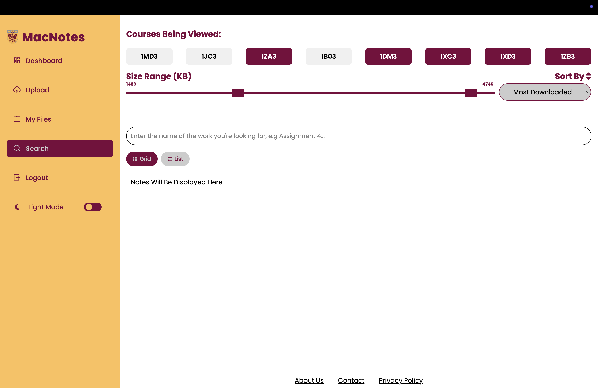
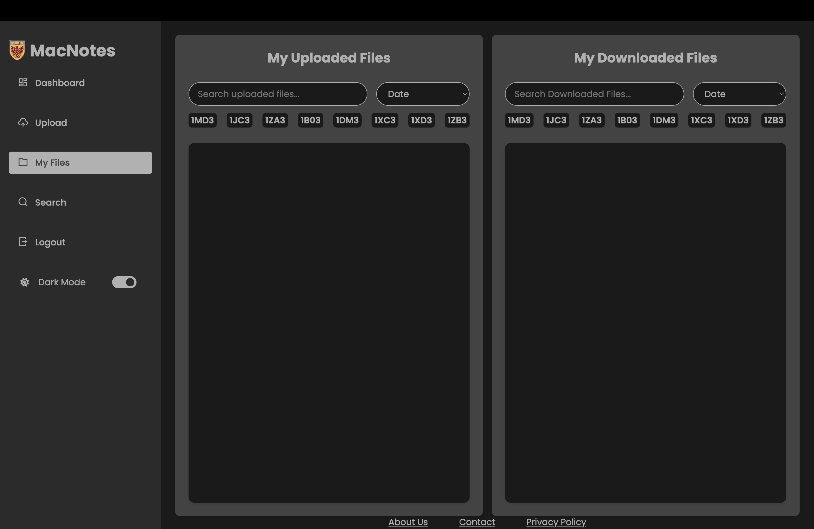

# 📚 MacNotes 
MacNotes is a course-based note-sharing platform built for McMaster students. It was created to make it easier for students to share and access helpful notes across all programs and courses.

This project is still in progress and we’ve hosted a basic prototype to showcase the core functionality. The design isn’t final yet, but it gives a good idea of what we’ve been working on recently.

## 🔨 About the Project
As students, we’ve all had moments where we needed notes but couldn’t find any, or had really great notes and nowhere to share them. That’s what inspired us to build MacNotes, a place where students can help each other by uploading, rating, and reviewing course notes.

MacNotes lets users:

• 📤 Upload their notes for specific courses  
• 📥 Browse and download notes from other students  
• ⭐ Rate and review uploaded notes  
• 🚩 Report inappropriate or low-quality content for review  

## 🌟 Features

1) User Uploads: students can upload notes with course info, file names, and descriptions.  
2) Download and Ratings: notes can be browsed, rated, and downloaded by anyone in the community.  
3) Reporting System: a simple way to flag inappropriate or irrelevant uploads.  
4) Course-Based Browsing: notes are organized by course codes to keep everything clean and easy to find.  

## 🧰 Technologies Used

• Frontend: HTML, CSS, JavaScript  
• Backend: Springboot  
• Database: PostgreSQL  
• Hosting: McMaster internal server for prototype  

## 🚧 Current Status

This is a basic prototype and is still under development. We’re actively working on:  

• Improving the overall UI  
• Adding login and authentication  
• Better file handling and data validation  
• Making the website responsive for mobile users  

## ✨ Our Vision

We want MacNotes to become a helpful, reliable resource for students across McMaster. Whether you missed a class, want to study smarter, or just want to give back by uploading great notes; MacNotes is here to make that easier. The idea is simple: share what helps you, and help others along the way.  

Thanks for checking out MacNotes! Feel free to explore the code, give feedback, or fork the repo. More updates coming soon! 🚀
